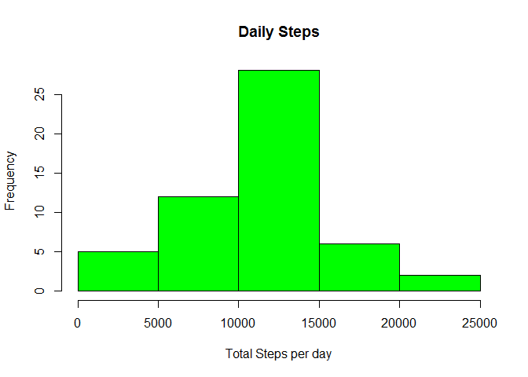
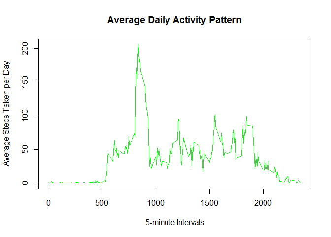
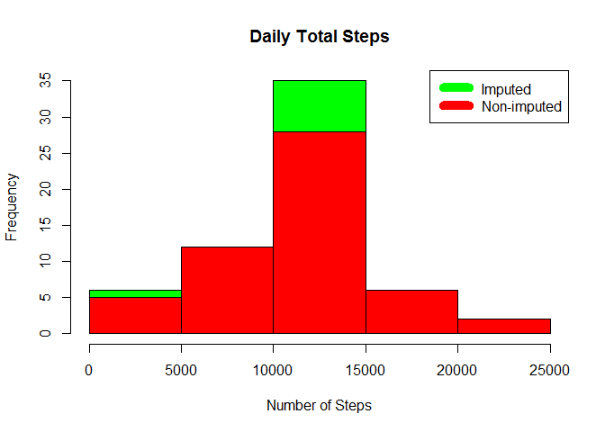
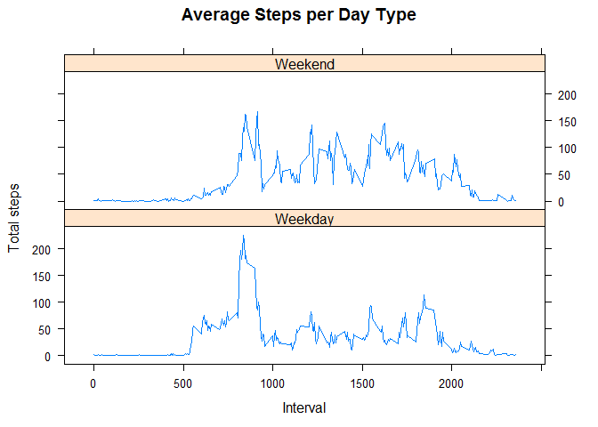

# PA1_Template
Michael Suder  
March 12, 2017  
# Reproducible Research: Assignment 1

## Load the data into the global enviornment

```r
hwdata <- read.csv("activity.csv", header = T, sep = ",")
```
# Question 1 What is mean total number of steps taken per day?

1) Calculate the total number of steps taken per day 


```r
# Aggregate the data to create a useable data frame
hwsteps <- aggregate(steps ~ date, data = hwdata, FUN = sum, na.rm = T)
```

2) Make a histogram of the total number of steps taken each day

```r
#create a histogram of the aggregate data to show steps taken per day
hist(hwsteps$steps,
     main = "Daily Steps",
     ylab = "Frequency",
     xlab = "Total Steps per day",
     col = "green")
```

<!-- -->

3) Calculate and report the mean and median total number of steps taken per day

```r
# assign the mean
hwmean <- mean(hwsteps$steps, na.rm = T)

# assign the median
hwmedian <- median(hwsteps$steps, na.rm = T)

# print the mean
hwmean
```

```
## [1] 10766.19
```

```r
# print the median
hwmedian
```

```
## [1] 10765
```

# Question 2 What is the average daily activity pattern?

1)	Make a time series plot (i.e. type = "l" ) of the 5-minute interval (x-axis) and the average number of steps taken, averaged across all days (y-axis)

```r
# find the mean of the interval of steps to determine the 5 minute intervals
hw5minintervals <- aggregate(steps ~ interval, data = hwdata, FUN = mean, na.rm = T)
```


```r
# create a line plot to show fluxuation of the intervals 
plot(x = hw5minintervals$interval, 
     y = hw5minintervals$steps, 
     type = "l", 
     main = "Average Daily Activity Pattern",
     xlab = "5-minute Intervals",
     ylab = "Average Steps Taken per Day", 
     col = "green")
```

<!-- -->

2)	Which 5-minute interval, on average across all the days in the dataset, contains the maximum number of steps?

```r
# Find and paste the max data point in the 5 minute interval data set
hwintervalsmax <- hw5minintervals$interval[which.max(hw5minintervals$steps)]
```

#Question 3 Imputing missing values

1)	Calculate and report the total number of missing values in the dataset

```r
# finding the total number of NA's in the data set
hwmissing <- sum(!complete.cases(hwdata))

hwmissing
```

```
## [1] 2304
```


2)	Create a new dataset that is equal to the original dataset but with the missing data filled in.

```r
# transform the new NA data set and match it with the original data set
transformhwdata <- transform(hwdata, steps = ifelse(is.na(hwdata$steps),
                  hw5minintervals$steps[match(hwdata$interval, hw5minintervals$interval)], hwdata$steps))

transformhwdata[as.character(transformhwdata$date) == "2012-10-01", 1] <-0

# aggregate the newly formed data

dailysteps <- aggregate(steps ~ date, data = transformhwdata, FUN = sum)
```


3)	Make a histogram of the total number of steps taken each day and Calculate and report the mean and median total number of steps taken per day. 

```r
# creating a histogram for original data set
hist(x =dailysteps$steps,
     main = "Daily Total Steps",
     xlab = "Number of Steps",
     col = "green")

# Creating a histogram of new data set to overlap original

hist(x=hwsteps$steps,
     main = "Dialy Total Steps",
     xlab = "Number of Steps",
     col = "red",
     add = T)
legend("topright", c("Imputed", "Non-imputed"), col=c("green", "red"), lwd=10)
```

<!-- -->


```r
##Find mean for transformation
hwmean2 <- mean(dailysteps$steps)
hwmedian2 <- median(dailysteps$steps)
```


```r
## difference of means and median

meandiff <- hwmean2 - hwmean

meandiff
```

```
## [1] -176.4949
```

```r
mediandiff <- hwmedian2 - hwmedian

mediandiff
```

```
## [1] 1.188679
```


```r
## Finding the total diffrence
difference <- sum(dailysteps$steps) - sum(hwsteps$steps)

difference
```

```
## [1] 75363.32
```


#Question 4 Are there differences in activity patterns between weekdays and weekends?


1)	Create a new factor variable in the dataset with two levels - "weekday" and "weekend" indicating whether a given date is a weekday or weekend day.


```r
# create week day names
Weekdaysnames <- c("Monday", "Tuesday", "Wednesday", "Thursday", "Friday")

# add weekdaysnames to the data set to transform the  dates
weekdayintervals <- as.factor(ifelse(is.element(weekdays(as.Date(transformhwdata$date)), Weekdaysnames), "Weekday", "Weekend"))

# aggregate the new data
newhwinterval <- aggregate(steps ~ interval + weekdayintervals, data = transformhwdata, FUN = mean)

head(newhwinterval)
```

```
##   interval weekdayintervals      steps
## 1        0          Weekday 2.21299790
## 2        5          Weekday 0.43773585
## 3       10          Weekday 0.17023061
## 4       15          Weekday 0.19454927
## 5       20          Weekday 0.09727463
## 6       25          Weekday 1.54381551
```


2)	Make a panel plot containing a time series plot (i.e. type = "l" ) of the 5-minute interval (x-axis) and the average number of steps taken, averaged across all weekday days or weekend days (y-axis).


```r
# load the lattice package
library(lattice)

# create two line plots to show the difference between weekdays and weekend
xyplot(newhwinterval$steps ~ newhwinterval$interval | newhwinterval$weekdayintervals,
       type = "l",
       main = "Average Steps per Day Type",
       xlab = "Interval",
       ylab = "Total steps",
       layout= c(1,2))
```

<!-- -->

